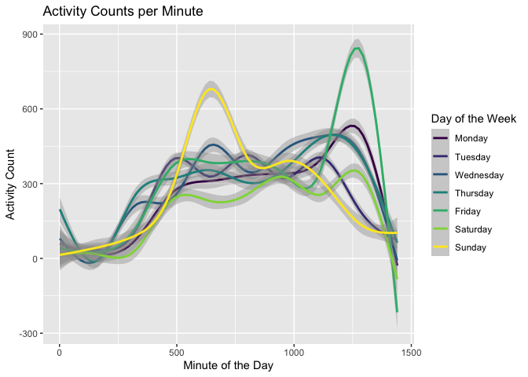

p8105_hw3_rh3064
================
Rahul Hosalli
2022-10-17

# Problem 2

## Data Loading

``` r
accel_data <- read_csv("./Data/accel_data.csv")
```

    ## Rows: 35 Columns: 1443
    ## ── Column specification ────────────────────────────────────────────────────────
    ## Delimiter: ","
    ## chr    (1): day
    ## dbl (1442): week, day_id, activity.1, activity.2, activity.3, activity.4, ac...
    ## 
    ## ℹ Use `spec()` to retrieve the full column specification for this data.
    ## ℹ Specify the column types or set `show_col_types = FALSE` to quiet this message.

## Data Tidying/Wrangling

The following chunk of code cleans the column names with
`janitor::clean_names()`, then using `mutate()` creates a new variable
*day_type* which indicates if it was a weekend or weekday. *day* and
*day_type* are coerced into factors.

Finally `relocate()` is used to reorder the tibble so that more useful
columns are first (*day_id*, *week*, *day*, *day_type*).

`head()` is used to take a glance at the tibble and check the variable
classes, which seem reasonable.

Finally a new dataset is created by pivoting the original data with
`pivot_longer()` so that the data is tidy.

``` r
accel_data <- 
  accel_data %>%
  janitor::clean_names() %>%
  mutate(
    
    day_type = case_when(day == "Saturday" | day == "Sunday" ~ "Weekend",
                         TRUE ~ "Weekday"),
    
    day = factor(day, levels = c("Monday", "Tuesday", "Wednesday", "Thursday",
                                 "Friday", "Saturday", "Sunday")),
    day_type = factor(day_type)
    
    ) %>%
  relocate(day_id, week, day, day_type)

head(accel_data)
```

    ## # A tibble: 6 × 1,444
    ##   day_id  week day      day_type activ…¹ activ…² activ…³ activ…⁴ activ…⁵ activ…⁶
    ##    <dbl> <dbl> <fct>    <fct>      <dbl>   <dbl>   <dbl>   <dbl>   <dbl>   <dbl>
    ## 1      1     1 Friday   Weekday     88.4    82.2    64.4    70.0    75.0    66.3
    ## 2      2     1 Monday   Weekday      1       1       1       1       1       1  
    ## 3      3     1 Saturday Weekend      1       1       1       1       1       1  
    ## 4      4     1 Sunday   Weekend      1       1       1       1       1       1  
    ## 5      5     1 Thursday Weekday     47.4    48.8    46.9    35.8    49.0    44.8
    ## 6      6     1 Tuesday  Weekday     64.8    59.5    73.7    45.7    42.4    58.4
    ## # … with 1,434 more variables: activity_7 <dbl>, activity_8 <dbl>,
    ## #   activity_9 <dbl>, activity_10 <dbl>, activity_11 <dbl>, activity_12 <dbl>,
    ## #   activity_13 <dbl>, activity_14 <dbl>, activity_15 <dbl>, activity_16 <dbl>,
    ## #   activity_17 <dbl>, activity_18 <dbl>, activity_19 <dbl>, activity_20 <dbl>,
    ## #   activity_21 <dbl>, activity_22 <dbl>, activity_23 <dbl>, activity_24 <dbl>,
    ## #   activity_25 <dbl>, activity_26 <dbl>, activity_27 <dbl>, activity_28 <dbl>,
    ## #   activity_29 <dbl>, activity_30 <dbl>, activity_31 <dbl>, …

``` r
accel_long <- accel_data %>% 
  pivot_longer(activity_1:activity_1440, 
               names_to = "minute", 
               names_prefix = "activity_", 
               values_to = "activity_count") %>%
  mutate(minute = as.numeric(minute))
```

## Data Description

There are 50400 rows and 6 columns in the *`accel_long`* tibble.
*day_id* corresponds to the actual study data of collection. In the
original `accel_data` tibble this was of length 35, and corresponded to
the unique day of collection. Following the pivot, this variable was
duplicated numerous times, as the length of the pivoted tibble is
determine by 1440 minutes \* 35 days. The numeric variable *week*
corresponds to the study week, and *day* corresponds to the day of week.
The day variable was coerced to a factor and assigned ordered levels to
ensure proper formatting later. *day_type* is a factor variable
corresponding to the type of day (weekend vs weekday) and is unordered.
*minute* is a numeric variable corresponding to the minute of the day
(from 1 to 1440 for each unique day). Finally, *activity_count* is
numeric variable of accelerometer data per minute.

## Total Activity per Day

Total activity count per day per week is calculated by first grouping
the data using `group_by()` . Next, `summarise()` is used with `sum()`
to calculate the activity totals. This is then piped to `pivot_wider()`
to produce a more readable, non-tidy dataframe which is finally
outputted via `knitr::kable()`.

``` r
accel_long %>%
  group_by(week, day) %>%
  summarise(activity_total = sum(activity_count)) %>%
  pivot_wider(names_from = "day",
              values_from = "activity_total") %>%
knitr::kable(caption = "Total Activity Counts by Week and Day")
```

    ## `summarise()` has grouped output by 'week'. You can override using the
    ## `.groups` argument.

| week |    Monday |  Tuesday | Wednesday | Thursday |   Friday | Saturday | Sunday |
|-----:|----------:|---------:|----------:|---------:|---------:|---------:|-------:|
|    1 |  78828.07 | 307094.2 |    340115 | 355923.6 | 480542.6 |   376254 | 631105 |
|    2 | 295431.00 | 423245.0 |    440962 | 474048.0 | 568839.0 |   607175 | 422018 |
|    3 | 685910.00 | 381507.0 |    468869 | 371230.0 | 467420.0 |   382928 | 467052 |
|    4 | 409450.00 | 319568.0 |    434460 | 340291.0 | 154049.0 |     1440 | 260617 |
|    5 | 389080.00 | 367824.0 |    445366 | 549658.0 | 620860.0 |     1440 | 138421 |

Total Activity Counts by Week and Day

There is no obvious trend in activity count data, although there is a
very low count on Saturday in week 4 and 5; this count corresponds to an
activity count of 1 per minute, while the average activity count per
minute is 267.04. This might indicate an error with the accelerometer on
those days, or non-use of the device.

## Plots

``` r
ggplot(accel_long, mapping = aes(minute, activity_count)) +
  geom_line(aes(color = day), alpha =0.7) +
  labs(
    x = "Minute of the Day", 
    y = "Activity Count", 
    title = "Activity Counts per Minute") +
  
  scale_color_viridis(
    name = "Day of the Week",
    discrete = TRUE
  )
```

<!-- -->

The largest spike in counts is around the 1250 minute mark, which
corresponds to around around 8:30 to 9:00 PM. The lowest activity is
seen in the first 300 or so minutes, which corresponds to before 5AM,
i.e. when they were asleep. General trends by day are difficult to parse
due to the dense overlap of lines.

``` r
ggplot(accel_long, mapping = aes(minute, activity_count)) +
  geom_smooth(aes(color = day)) +
  labs(
    x = "Minute of the Day", 
    y = "Activity Count",
    title = "Activity Counts per Minute") +
  
  scale_color_viridis(
    name = "Day of the Week",
    discrete = TRUE
  )
```

    ## `geom_smooth()` using method = 'gam' and formula 'y ~ s(x, bs = "cs")'

<!-- -->

If we use `geom_smooth()` we can get a better sense of activity count
trends by day of the week. There is a spike of activity on Sunday at
around minute 600, which corresponds to 10AM.

# Problem 3

## Data Loading

``` r
library(p8105.datasets)
data("ny_noaa")
```

## Data Cleaning

Initial the data is cleaned by coercing tmax and tmin into integers.
tmax tmin and prcp are then divided by 10 to get the correct C and mm
values (originally the data is provided in tenths of degrees C or tenths
of mm).

Then, `janitor::clean_names()` is used, and *date* is separate into
three columns with `separate()`. The *year, month* and *date* variables
are coerced into integer variables. *tmax* and *tmin* are coerced into
integers as well. Alongside *prcp*, these three variables are provided
as tenths if degrees C or tenths of mm, so they are divided by 10 to get
degrees C or mm measurements.

``` r
noaa_df <- ny_noaa %>%
  janitor::clean_names() %>%
  
  separate(date, into = c("year", "month", "date"), sep = "-") %>% 
  
  mutate(year = as.integer(year),
         month = as.integer(month),
         date = as.integer(date),
         
         tmax = as.integer(tmax)/10,
         tmin = as.integer(tmin)/10,
         prcp = prcp/10)
         
head(noaa_df)
```

    ## # A tibble: 6 × 9
    ##   id           year month  date  prcp  snow  snwd  tmax  tmin
    ##   <chr>       <int> <int> <int> <dbl> <int> <int> <dbl> <dbl>
    ## 1 US1NYAB0001  2007    11     1    NA    NA    NA    NA    NA
    ## 2 US1NYAB0001  2007    11     2    NA    NA    NA    NA    NA
    ## 3 US1NYAB0001  2007    11     3    NA    NA    NA    NA    NA
    ## 4 US1NYAB0001  2007    11     4    NA    NA    NA    NA    NA
    ## 5 US1NYAB0001  2007    11     5    NA    NA    NA    NA    NA
    ## 6 US1NYAB0001  2007    11     6    NA    NA    NA    NA    NA

``` r
noaa_df %>% 
  summarise(n_miss = sum(is.na(.)),
            n_obs = n()*ncol(.),
            percent_miss = (n_miss/n_obs)*100) %>% 
  knitr::kable()
```

|  n_miss |    n_obs | percent_miss |
|--------:|---------:|-------------:|
| 3387623 | 23356584 |     14.50393 |

## Data Description

The data contains 2595176 rows and 9 columns. *id* indicates the weather
station ID, why *year, month* and *day* indicate the date of
observation. *prcp* is the precipitation in mm, while *snow* is snowfall
in mm and *snwd* is the snow depth in mm. *tmax* and *tmin* are the
maximum and minimum temperature on a given date, in degrees C. Roughly
14.5% of the total cells of the dataframe are missing. The most commonly
observed snowfall value (ignoring NA’s) is 0 which is likely due to the
fact that snowfall is expected to occur during the winter months, and
wouldn’t occur for most of the year.

## Plots

### Plot 1

``` r
plot1_df<- noaa_df %>%
  mutate(month_name = month.name[month]) %>%
  filter(
    month_name %in% c(month.name[1], month.name[7])) %>% 
  group_by(id, year, month_name) %>% 
  summarize(
    tmax_avg = mean(tmax)
  )
```

    ## `summarise()` has grouped output by 'id', 'year'. You can override using the
    ## `.groups` argument.

``` r
ggplot(plot1_df, mapping = aes(x = year, y = tmax_avg, color = id)) +
  geom_line(alpha = 0.5) +
  facet_grid(. ~ month_name) +
  labs(
    x = "Year",
    y = "Mean Maximum Temperature (C)",
    title = "Mean max temperature 1981-2010 : January vs. July"
  )+
  theme(legend.position = "none") +
  scale_color_viridis(option = "inferno", discrete = TRUE)
```

    ## Warning: Removed 6007 row(s) containing missing values (geom_path).

<!-- -->

The January average temperature is roughly between -10C and 10C, while
the July average temperature is between 20C and 35C. Mean maximum
temperature seems to go up and down year to year in both January and
July. There were outlier months around 1994 an 2004 in January, and in
1987 in July at a single weather station.

### Plot 2

``` r
plot1 <- noaa_df %>% 
  ggplot(mapping = aes(x = tmin, y = tmax)) +
  geom_hex(bins = 100) +
  labs(
    x = "Minimum Temperature (C)",
    y = "Maximum Temperature (C)",
    title = "Hexagonal Heatmap of Minimum and Maximum Temperature"
  )
plot2 <- noaa_df %>% 
  filter(snow > 0 & snow < 100) %>%
  ggplot(mapping = aes(x = snow, color = year, group = year)) +
  geom_density() +
  scale_color_viridis() +
  labs(
    x = "Snowfall (mm)",
    y = "Density",
    title = "Distribution of Snowfall by Year"
  )

plot1/plot2
```

    ## Warning: Removed 1136276 rows containing non-finite values (stat_binhex).

<!-- -->

The hexagonal heat map shows that minimum and maximum temperature seem
to have a positive, monotonic relationship.

The snowfall distributions plot shows that year to year differences in
snowfall distributions is small.
